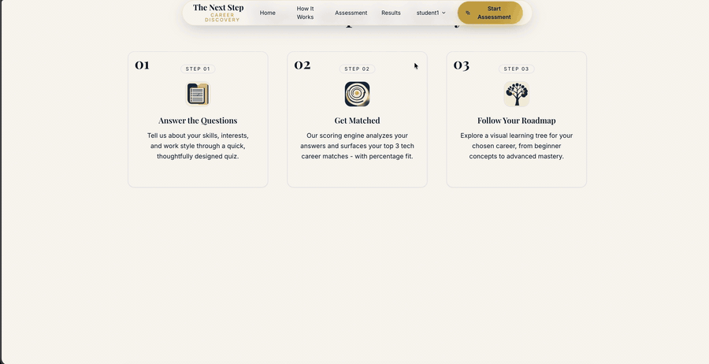
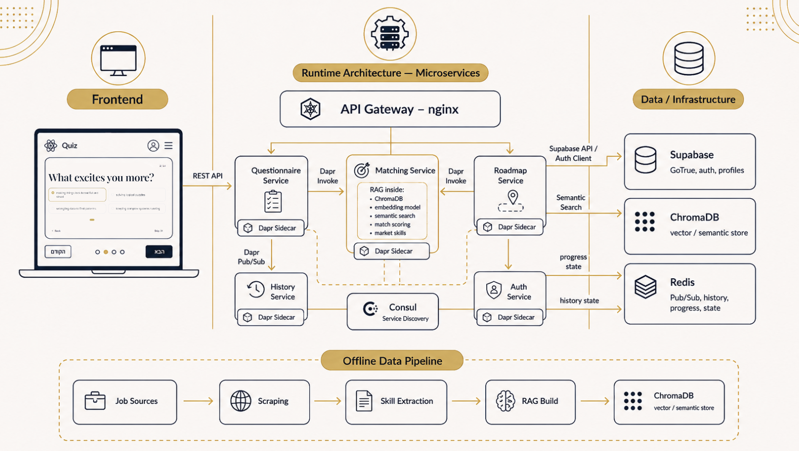

<div align="center">
  
</div>

# NextStep Career Matcher

A career-discovery platform: a personalized assessment matches users to one of
**16 tech careers** with explainable, job-market-backed recommendations, then
generates a personal learning roadmap enriched with the skills employers
actually ask for.

[](docs/assets/demo.mp4)

   
**[Full walkthrough (35s) ▶](docs/assets/demo.mp4)** 

## User flow

1. **Create an account** — email, password and a username, handled by Supabase
   GoTrue. Signing up also claims any assessment you already took anonymously in
   the same browser, so nothing is lost by trying the quiz first.
2. **Answer the questionnaire** — about 15 questions in 3–5 minutes, on skills,
   work style and personality fit. The bank holds 18: the career-family
   follow-ups branch on your earlier answers, so you only see the relevant ones.
3. **Add a profile** *(optional)* — your experience, projects and the skills you
   already have. Skip it and the result is identical to not having the step at
   all; fill it in and those skills both re-weight the score and make the
   "skills you have / still need" lists mean what they say.
4. **Get ranked matches** — the top 3 of 16 careers, each with a match
   percentage, the specific reasons behind it, and the skills you hold versus
   the ones you are missing.
5. **Choose a career** — your pick is recorded and unlocks that career's roadmap.
   A roadmap opens only for a career you hold a recommendation for: the same
   evidence that personalizes it is what authorizes it.
6. **Work the roadmap** — a visual skill graph where every node carries how often
   real job ads demand it. Tick nodes off as you learn them; progress is saved
   per user and is still there when you come back.


## Architecture




## Tech stack

**Services**

- **Python 3.12 + FastAPI + Pydantic** — all five backend services
- **Dapr 1.17.5** — service invocation, Redis pub/sub, state store (etag CAS)
- **Redis 7** — pub/sub broker and state (submissions, roadmap progress)
- **Consul 1.20** — service discovery for the Dapr sidecars
- **nginx 1.27** — API gateway, the single entry point on `:8000`
- **Supabase** — GoTrue auth, user profiles, job-posting reads
- **Docker Compose** — the whole stack, 13 containers, one command

**Frontend**

- **React 18 + Vite** — SPA, works offline when the backend is down
- **Tailwind CSS** — styling
- **framer-motion + lucide-react** — animation and icons

**Data pipeline**

- **ChromaDB** — vector store over ~1850 scraped job ads
- **sentence-transformers** (`all-MiniLM-L6-v2`) — embeddings for semantic matching
- **python-jobspy + feedparser + httpx** — job-ad scrapers in `data/scripts/`
- **Ollama + Qwen2.5 7B** — LLM panel that generates the silver training labels
- **PyTorch** — neural matcher, currently ranking-only (see ADR 0005)
- **scikit-learn** — logistic matcher and probability calibration
- **LightGBM** — benchmarked comparator, not shipped

How a submission flows:

```
questionnaire answers → POST /api/questionnaire/submit
  → matching-service builds a natural-language profile from the answers
  → queries the ChromaDB `job_ads` store (~1575 scraped ads, per career field)
  → blends semantic similarity + questionnaire fit + skill overlap into a score
  → top-3 explainable recommendations return to the SPA
  → the submission is published to Redis and persisted by history-service
```

## Quick start

Prerequisites: **Docker Desktop**, **Node 18+**, **Python 3.12**
(a venv at `backend/venv`, rebuildable from `backend/requirements.txt`).

```bash
# 0. one-time: build the job-ad vector store (~1575 ads, all-MiniLM-L6-v2)
backend/venv/bin/python data/scripts/build_rag.py

# 1. secrets
cp .env.example .env            # set APP_API_TOKEN (openssl rand -hex 16)
cp backend/.env.example backend/.env   # optional: SUPABASE_* (auth)

# 2. everything at once (compose stack + Vite + browser):
./dev.sh                        # Windows: powershell -ExecutionPolicy Bypass -File dev.ps1

# — or manually —
docker compose up -d --build    # 13 containers; gateway on :8000
cd frontend && npm install && npm run dev   # SPA on :3000
```

All external services are optional: without Supabase, auth routes return 503
(the questionnaire still works anonymously); without the ChromaDB store, matching
returns a safe 503 and the SPA shows its offline estimate. Roadmaps are always
curated static data — there is no generation step and nothing to configure.

Sidecars share their app's network namespace — restart pairs together:
`docker compose restart matching matching-dapr`.

## Public API (through the gateway)

| Route | Service | Purpose |
|---|---|---|
| `GET /api/questions` | questionnaire | adaptive question bank |
| `POST /api/questionnaire/submit` | questionnaire | answers → recommendations |
| `POST /api/questionnaire/select` | questionnaire | record the chosen career |
| `GET /api/health` | matching | RAG store status (`rag_doc_count`) |
| `GET/POST /api/roadmap/{id}` | roadmap | curated roadmap (POST also adds in-demand market skills) |
| `GET/POST /api/roadmap/{id}/progress` | roadmap | per-user completed nodes (auth) |
| `POST /api/auth/register\|login\|logout`, `GET /api/auth/me` | auth | Supabase GoTrue + usernames |
| `GET/PUT /api/profile` | auth | self-input profile: experience, projects, skills (auth) |
| `GET /api/admin/users`, `DELETE /api/admin/users/{id}` | auth | account list + deletion (admin role only — DEV-62) |
| `POST /api/auth/claim-sessions`, `GET /api/auth/my-submissions` | history | link anonymous submissions, submission history (auth) |

`/internal/*` (service-to-service), `/events/*` and `/dapr/*` (sidecar surface)
are deliberately not routed by the gateway.

### Example request / response

```bash
curl -s -X POST http://localhost:8000/api/questionnaire/submit \
  -H 'Content-Type: application/json' \
  -d '{"answers":{"q1":3,"q2":2,"q3":3,"q4":2,"q5":2,"q6":2,"q7":2,"q8":2,"q9":1,"q10":2}}'
```

```json
{
  "request_id": "…",
  "recommendations": [
    {
      "id": "data-science", "title": "Data Scientist", "description": "…",
      "keySkills": ["Python","Statistics","Machine Learning","SQL","Data Viz"],
      "icon": "BarChart2", "roadmapKey": "data-science",
      "matchPercent": 66, "score": 0.66,
      "score_breakdown": {"semantic_similarity": 0.31, "questionnaire_fit": 0.75, "skill_overlap": 0.8},
      "reasons": ["Strong alignment with your interests and work style",
                  "Builds on in-demand skills like Python, Statistics, Machine Learning"],
      "matched_skills": ["Python","Statistics","Machine Learning","SQL"],
      "missing_skills": ["R","Data Visualization","Excel","Hadoop"],
      "model_version": "formula-v1"
    }
  ]
}
```

### Matching formula

```
final = 0.40 * questionnaire_fit + 0.40 * semantic_similarity + 0.20 * skill_overlap
```

This is the **formula matcher**. When the self-input profile (see below) carries at
least one skill tag — from the Skills section or a project's technologies — the
formula gains a fourth term, taken from the two market-derived components; the
questionnaire keeps its weight:

```
final = 0.40 * questionnaire_fit + 0.30 * semantic_similarity
      + 0.10 * skill_overlap     + 0.20 * user_skill_match
```

A tag counts if it is **predominantly Latin script**, whether or not it is a skill
we recognize — `foobar` counts, a Hebrew tag does not. A profile of only
experience/project *prose* therefore keeps the three-term formula, while still
shifting the result through the embedding. A profile whose content is entirely
non-Latin moves neither: those tags and sentences are dropped from the embedding
query as well, leaving only the skill labels and `model_version` affected.

> **Known wart.** A tag we can't match against any career or job ad (`foobar`, or a
> real skill missing from the catalog like `Svelte 5`) still switches the fourth
> term on, where it scores 0 for every career. Each career then loses
> `0.10 * (semantic_similarity + skill_overlap)` — **not** a flat penalty: it bites
> hardest on the careers with the strongest semantic and market evidence. The tag
> separately enters the embedding query ("I know foobar."), moving
> `semantic_similarity` per career on its own. Between the two channels, entering a
> skill we don't recognize can both lower the percentages and reorder the results
> relative to skipping the step. Entering more information should never make your
> results worse — see `_profile_context()` in `matching_service.py` for where the
> gate would need to move.

### Self-input profile (optional step)

Between the questionnaire and the results, a signed-in user can enter work
experience, projects and skills. Everything about it is optional: skip it, or leave
it empty, and matching is byte-identical to the formula above.

Supplying one changes the result two ways — the prose is appended to the embedding
query (so `semantic_similarity` shifts toward the fields you actually have
background in) and your skills are scored against each career's key skills plus
that field's market demand. It also makes `matched_skills` / `missing_skills`
describe *you* rather than the job market, which is what colours the roadmap's
skill-gap nodes.

```bash
# same answers, with a profile -> different ranking and truthful skill lists
curl -s -X POST http://localhost:8000/api/questionnaire/submit \
  -H 'Content-Type: application/json' \
  -d '{"answers":{"q1":3,"q2":1,"q4":2,"q5":1,"q7":2,"q10":1},
       "profile":{"skills":["Python","SQL","Tableau"],
                  "experience":[{"role":"Data Analyst","context":"a fintech",
                                 "duration_months":24,
                                 "description":"built dashboards and SQL pipelines"}]}}'
```

Saved per user in Supabase `user_profile_data` via `GET/PUT /api/profile`, and
snapshotted onto each submission so restoring a past result restores the profile it
was scored with. English-only: the career catalog, job-ad corpus and embedding
model are all English, so non-Latin prose is excluded from the query rather than
degrading it.

- `questionnaire_fit` — per-career answer weights + bonuses, normalized against
  the strongest-fitting career.
- `semantic_similarity` — ChromaDB cosine distance converted to `1 - distance`.
- `skill_overlap` — share of a career's key skills present in the retrieved ads.

Weights live in `services/matching/app/services/matching_service.py`, asserted
to sum to 1. An optional learned (logistic-regression) matcher can replace the
formula via `MATCHER_MODEL_PATH` — training pipeline under `data/scripts/`.

## Tests

Each service has an isolated suite — external calls are faked at seams, so no
Docker, sidecar, or database is needed:

```bash
cd services/<questionnaire|matching|roadmap|auth|history>
../../backend/venv/bin/python -m pytest tests -q
```

> If a suite fails for no apparent reason after you've reverted an edit, clear the
> stale bytecode first: `find services -name __pycache__ -type d -exec rm -rf {} +`.

## Environment variables

Two scopes (they do not overlap):

| Scope | File | Keys |
|---|---|---|
| docker-compose interpolation | repo-root `.env` | `APP_API_TOKEN` — **required**; gates history-service's event-ingestion endpoints. Also `MATCHER_MODEL_PATH` — see below |
| services (via `env_file`) + data pipeline | `backend/.env` | `SUPABASE_URL` / `SUPABASE_SERVICE_KEY` (auth + job_postings; service-role key, server-only), `OPENAI_API_KEY` (read only by `backend/scripts/generate_expert_answers.py`, an offline quiz-data script — no service reads it), `CHROMA_*`, `RAG_TOP_K`, `REQUIREMENTS_*` (market-skill thresholds), `MATCHER_MODEL_PATH` (**local `dapr run` / uvicorn only** — see below) |
| frontend | `frontend/.env` | `VITE_API_BASE_URL` (default `http://localhost:8000` — the gateway) |

Container-specific values (`CHROMA_PATH=/store/chroma`, `DAPR_ENABLED`,
`CORS_ORIGINS`) are pinned per service in `docker-compose.yml`.

**`MATCHER_MODEL_PATH` appears in both scopes and only one of them wins under
compose.** `backend/.env`'s value reaches `auth` and `roadmap` through `env_file`,
and both ignore it — only `services/matching/app/main.py` reads the setting, even
though `common/config.py` defines it for every service. For `matching`,
`docker-compose.yml`'s `environment:` key overrides `env_file:` and interpolates
the **repo-root** `.env` instead, which needs a *container* path
(`/store/models/...`; `data/models` is mounted read-only at `/store/models`).
Verify with `docker compose config` rather than by reading. The repo-root `.env`
sets it to `/store/models/matcher_nn_v1.json` — DEV-99 flipped it on 2026-08-04
after human approval, so the neural matcher serves. It supplies the **selection**
only: every displayed percentage is still the formula's, per ADR 0005's
mitigable-ECE branch. `backend/.env` still points at the stale `matcher_logistic_v1`,
which is refused on load and never reaches `matching` anyway.

**Rollback:** blank that one line and restart `matching` + `matching-dapr` together
(shared netns). No code redeploy. It does not rewrite already-persisted submissions,
which keep the `model_version`/`model_caveats` they were scored with.

**Changing the flag can require a rebuild, not just a restart.** An image built
before the DEV-88 dispatch seam has no `matcher.py`, so the neural artifact is
refused with `malformed model artifact ...: 'coef'` — the linear loader's error,
which reads like a bad artifact and is really a stale build. Use
`docker compose up -d --build matching matching-dapr` and confirm the
`Learned matcher loaded: matcher-nn-v1` line in `docker compose logs matching`.
Evidence and the decision: `docs/dev-23-flip-readiness.md`,
`docs/dev-23-nn-decision.md`.

## Project structure

```
Next_step_FP/
├── services/
│   ├── common/            # shared wire contracts: models, topics, config, Dapr client, auth dep, data JSONs
│   ├── questionnaire/     # questions + submit/select (publishes to Redis)
│   ├── matching/          # ChromaDB RAG + scoring (+ /internal/match, /internal/field-skills)
│   ├── roadmap/           # curated roadmaps + market requirements + progress
│   ├── auth/              # Supabase GoTrue + usernames + self-input profile (+ /internal/verify)
│   ├── history/           # submissions in the Dapr state store (subscribers + history routes)
│   ├── gateway/nginx.conf # path routing on :8000
│   └── dapr/              # sidecar components (Redis) + config (Consul resolver)
├── docker-compose.yml     # 5 app+sidecar pairs · redis · consul · gateway
├── frontend/src/          # App.jsx (single-page SPA), api.js, data.js (offline fallback), pages/
├── backend/               # venv (test runner) · .env (secrets) · Supabase migrations — the pre-split
│                          #   monolith was removed at the microservices cutover
├── data/
│   ├── scripts/           # scrapers, extract_skills, build_rag, matcher training
│   └── jobs/              # raw/*.json + chroma/ (gitignored)
└── docs/                  # architecture.md · dapr.md · matching-rework-plan.md
```

## License

MIT
