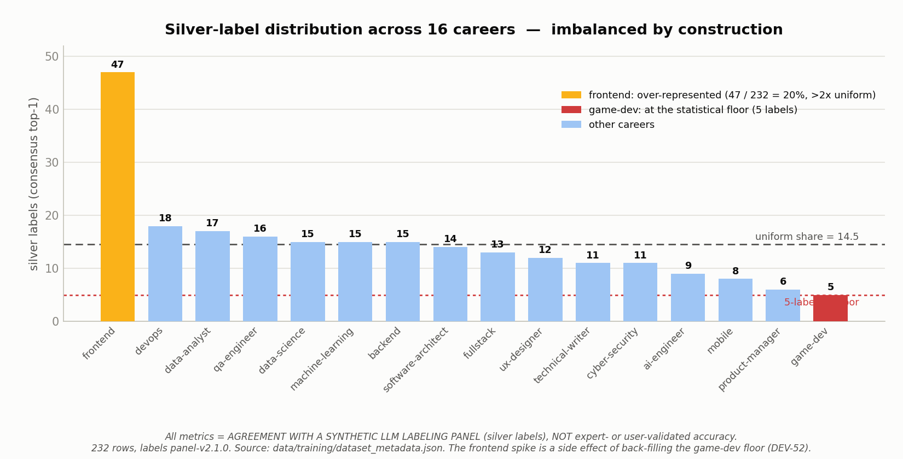
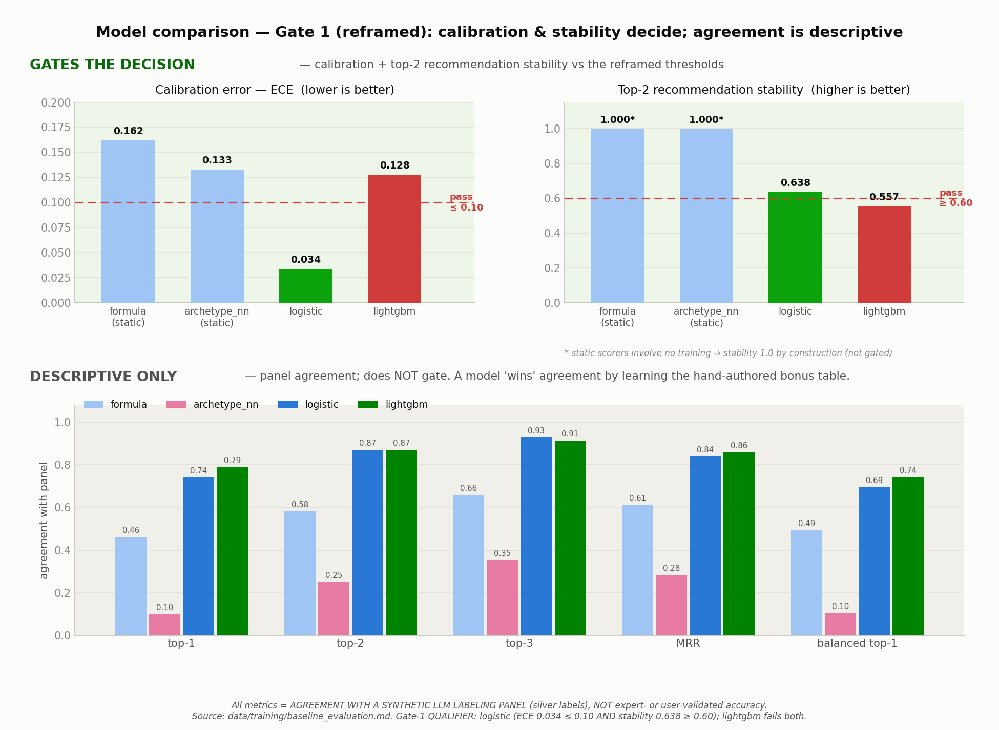
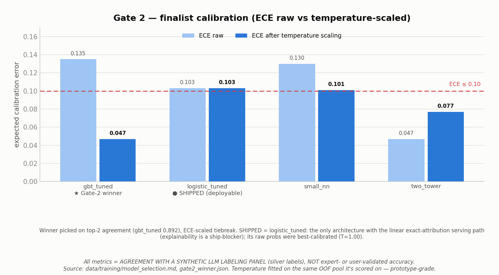
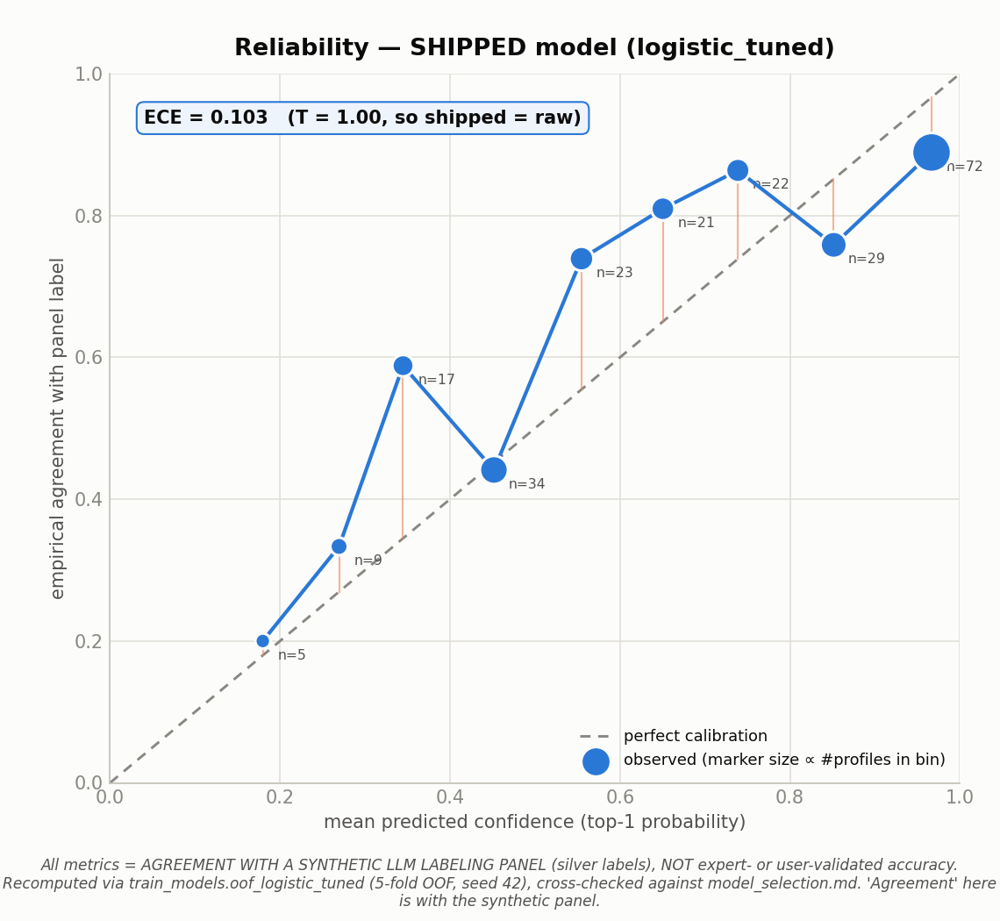
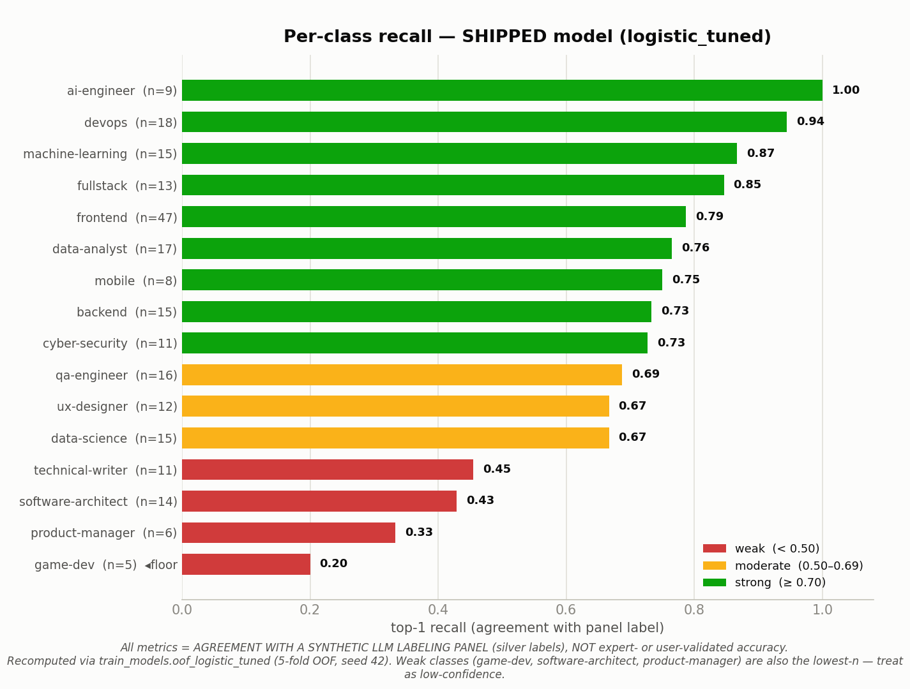

# Matcher evaluation — visualizations (DEV-53)

Static, embeddable PNGs of the **current** matcher-rework evaluation, generated from
the committed artifacts under `data/training/` and the shipped model
(`data/models/matcher_logistic_v2.json`).

> **FRAMING (applies to every chart below).** All metrics measure **agreement with a
> synthetic LLM labeling panel** (silver labels, `panel-v2.1.0`), **not** expert- or
> user-validated real-world accuracy. The panel's stage-2 vote follows the answer key
> derived from `careers.json` bonuses ~94% of the time it speaks, so a model that
> "wins" on agreement has largely learned the hand-authored bonus table. A clean chart
> here means *internally consistent with the synthetic labels*, nothing more.

Regenerate with:

```bash
python data/scripts/visualize_matcher_evaluation.py   # writes the 5 PNGs in this folder
```

The comparison tables (figs 1–3, and fig 5's legend thresholds) are transcribed from
the committed report artifacts and cited under each figure — those reports are the
authoritative published results. The shipped model's reliability curve (fig 4) and
per-class recall bars (fig 5) are **recomputed from data** via the exact Phase-3
pipeline code (`train_models.oof_logistic_tuned`, 5-fold OOF, seed 42) and
cross-checked against the report headline numbers before rendering.

---

## 1. Silver-label distribution across all 16 careers



232 labeled profiles spread very unevenly. **game-dev sits at the statistical floor
(5 labels)** — the stratified-5-fold CV minimum — so its metrics are low-confidence.
**frontend is over-represented (47 / 232 = 20%, >2× the uniform share)**; that spike
is a side effect of back-filling the game-dev/PM floor during the DEV-52 data-quality
pass. `class_weight="balanced"` counters amplification during training, but the skew
remains in the data. *Source: `data/training/dataset_metadata.json`.*

## 2. Model comparison — Gate 1 (gating vs descriptive)



The reframed Gate 1 no longer asks "does a learned model beat the formula on
agreement?" (that criterion is circular under key-anchored labels). It gates on two
things — shown in the **green GATING zone**:

- **Calibration (ECE ≤ 0.10)** and **top-2 recommendation stability (≥ 0.60)**.
- **logistic qualifies** (ECE 0.034, stability 0.638). **lightgbm fails both.** Static
  scorers (formula, archetype_nn) are shown for reference but are not gated —
  stability is 1.0 by construction because they involve no training.

The **gray DESCRIPTIVE-ONLY zone** shows panel-agreement metrics (top-1/2/3, MRR,
balanced top-1). These are **context, not the gate** — deliberately separated so a
strong agreement bar is never mistaken for a passing grade. *Source:
`data/training/baseline_evaluation.md`.*

## 3. Model comparison — Gate 2 finalist calibration



Phase-3 finalists, calibration before vs after temperature scaling. The **Gate-2
winner is `gbt_tuned`** (highest top-2 agreement, best ECE-after-scaling), but the
**SHIPPED model is `logistic_tuned`**: it is the only architecture with the linear,
exact-attribution serving path required by the explainability ship-blocker, and its
raw probabilities were already best-calibrated (T = 1.00). Temperature is fitted on
the same out-of-fold pool it is scored on — prototype-grade, redo on gold labels.
*Source: `data/training/model_selection.md`, `gate2_winner.json`.*

## 4. Reliability curve — shipped model



Reliability diagram for the shipped `logistic_tuned` artifact (T = 1.00 ⇒ shipped ==
raw). Points above the diagonal mean the model is **under-confident** in that bin
(empirical agreement exceeds stated confidence); marker size ∝ number of profiles in
the bin. Pooled ECE = 0.103. Low-confidence bins are sparse, so the left-hand points
carry wide uncertainty. *Recomputed via `train_models.oof_logistic_tuned`.*

## 5. Per-class recall — shipped model



Top-1 recall per career for the shipped model, weakest at the bottom. The weak classes
(**game-dev 0.20, product-manager 0.33, software-architect 0.43, technical-writer
0.45**) are largely the **lowest-n** classes — the same floor visible in fig 1 — so
their scores are the least trustworthy. devops/ai-engineer/frontend are strong.
*Recomputed via `train_models.oof_logistic_tuned`.*

---

## What was stale in the original DEV-53 ticket

The ticket was written on 2026-07-04 and predates several rounds of rework:

- **"the 6 careers"** — the catalog is now **16**; the label set and every per-class
  chart span all 16.
- **"using/extending `data/scripts/create_visualizations.py`"** — that script belongs
  to a **different, orphaned pipeline** (the question-bank INTEREST/TRAIT/ORIENTATION
  labeling experiment). It has nothing to do with the matcher training pipeline
  (`panel_label_profiles.py → build_training_set.py → evaluate_matchers.py →
  train_models.py → export_model.py`), so a **new** script
  (`visualize_matcher_evaluation.py`) was written instead of extending it.
- **"PM/frontend imbalance"** — the current floor class is **game-dev (5)**; frontend
  is the over-represented one (47). PM (6) is near the floor but no longer *the* headline.
- **"devops-skew finding from Phase 2/3"** — stale. That skew was on the old 6-career
  real-profile formula. For the current shipped `logistic_tuned`, devops is a **strong**
  class (recall 0.94); the weak classes are game-dev / product-manager /
  software-architect / technical-writer.
- **"archetype_nn"** — still present, but only as a **zero-train reference baseline** in
  Gate 1 (top-1 0.099), not a serious candidate. The real Gate-2 challengers are
  `gbt_tuned`, `logistic_tuned`, `small_nn`, `two_tower`.
- The ticket's **"shipped `logistic_tuned`, raw vs temperature-scaled ECE"** is
  accurate in spirit: the shipped artifact uses T = 1.00 (raw was best-calibrated),
  so raw *is* the shipped calibration — shown explicitly in figs 3 and 4.
